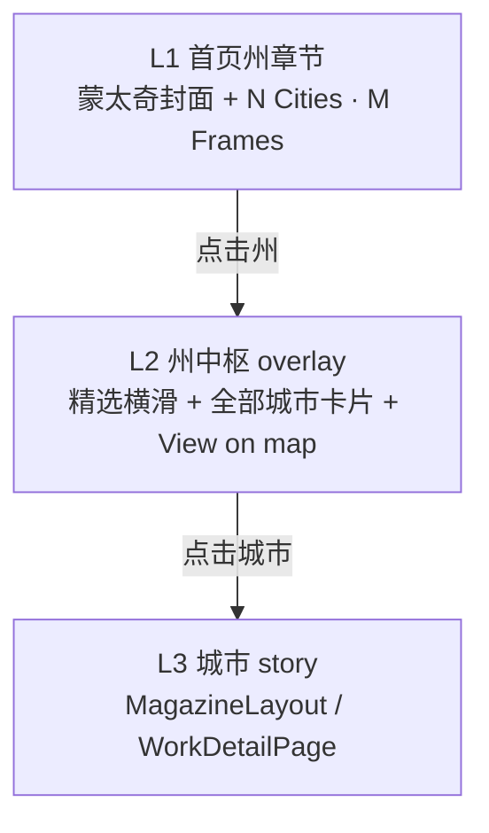

# 首页州级聚类（State Clustering）方案

## 背景与问题

原先首页是 **一个城市 = 一个 collection story** 的单层平铺。随着 collection 变多、内容变丰富，会出现：

- **审美疲劳**：单列重复的章节结构
- **内容过载**：滚动距离过长、侧边栏条目过多
- **聚类困境**：若按「州」只设一个入口，又担心 **州内多个城市 story 无法完全展示**

## 核心设计原则

**聚类 ≠ 隐藏内容。**

州只是 **入口**，不取代城市 story。用户点进州后进入 **州中枢页（L2）**，那里 **完整索引** 该州下所有城市；再点城市进入现有 **MagazineLayout / WorkDetailPage（L3）**。因此没有任何内容被「折叠埋掉」。

## 三层结构

| 层级 | 名称 | 作用 |
|------|------|------|
| L1 | 首页州章节 | 每个州一个章节，把首页条目数从「城市数」降到「州数」，缓解过载 |
| L2 | 州中枢 | 精选横滑 + **该州全部城市卡片**，解决「内容没法完全展示」 |
| L3 | 城市 story | 现有 `MagazineLayout`（首页 overlay）与 `/works/[slug]` 不变 |

## 1. 数据模型：给 collection 加 `state` 字段

- **Sanity**：`ryan/schemaTypes/collection.ts` 新增可选字段 `state`（State / Region，如 `Florida`）。
- **TypeScript**：`src/types.ts` 的 `Collection` 增加 `state?: string`。
- **上传脚本**：`scripts/upload-photos.mjs` 从 `State/City` 文件夹结构写入 `state`，并对已存在但缺失 `state` 的 collection **回填**。
- **首页查询**：`src/pages/index.astro` 的 GROQ 增加 `state` 字段。

### 向后兼容

- 未填 `state` 的 collection → 仍按原 `ArchiveChapter` **单独平铺**。
- 某 `state` 下 **只有 1 个城市** → 不套州层级，直接显示城市章节（避免无意义的「州套壳」）。

## 2. 首页按州分组渲染

- **分组逻辑**：`src/lib/stateGrouping.ts` 中的 `groupByState()`。
- **多城市州** → `StateChapter`（成员城市封面 **蒙太奇** + `N Cities · M Frames`），点击打开州中枢。
- **单城市 / 无 state** → 原 `ArchiveChapter`。
- **侧边栏** `SidebarItem`：支持州条目（可带 `3 Cities` 子标签）与城市条目。
- **移动端** `MobileFilmstripItem`：同样按分组；州条目带 badge。
- **节奏**：桌面章节 **左右交替偏移**（`lg:mr-[5%]` / `lg:ml-[5%]`），减轻单列重复感。

## 3. 州中枢（L2）

### 方案 A（已实现，推荐）

- 组件：`src/components/home/StateHub.tsx`
- 全屏 overlay，暗色编辑风，与 `MagazineLayout` 一致。
- 内容：州名 masthead、**精选 frames 横向滑动**、**该州全部城市卡片网格**、「View region on map」→ `/travel`。
- 点击城市 → `setSelectedCollection()` → 打开 `MagazineLayout`；关闭 story 回到州中枢，再关闭回到首页。

### 方案 B（可选后续）

- 独立路由：`src/pages/works/state/[state].astro`
- 利于 SEO / 分享链接，与方案 A 不冲突。

## 4. 缓解审美疲劳

- 州封面：**2–4 张**成员城市封面蒙太奇（非单图）。
- 章节布局：左右节奏交替。
- 州中枢：精选横滑展示跨城亮点。
- `/travel` 地图作为「查看全部地理内容」的兜底入口。

## 5. 如何启用

1. 在 **Sanity Studio** 中，给同一州下的多个 collection 填写相同的 `state`（如 `Florida`）。
2. 或重新运行 `node scripts/upload-photos.mjs <State>`，脚本会写入并回填 `state`。
3. 保存后重新 build / 刷新 dev，首页自动出现州聚类章节。

## 6. 实现文件清单

| 模块 | 路径 |
|------|------|
| Sanity schema | `ryan/schemaTypes/collection.ts` |
| 类型 | `src/types.ts` |
| 上传 / 回填 | `scripts/upload-photos.mjs` |
| GROQ | `src/pages/index.astro` |
| 分组工具 | `src/lib/stateGrouping.ts` |
| 州章节 | `src/components/home/StateChapter.tsx` |
| 州中枢 | `src/components/home/StateHub.tsx` |
| 首页接线 | `src/components/home/HomePage.tsx` |
| 侧边栏 | `src/components/home/SidebarItem.tsx` |

## 7. 待确认项（规划时）

- 州中枢长期用 **overlay（A）** 还是增加 **独立路由（B）**？
- 历史数据 `state`：**Studio 手填** 还是 **一次性 backfill 脚本**？

## 8. 关联 PR

- GitHub PR：[#19 — Home: cluster collections by state with a hub overlay](https://github.com/MrNiceguyRyan/Ryan_Gallery/pull/19)
- 分支：`cursor/state-clustering-home-bca4`

---

*文档生成自 state-clustering-home 实施计划。*
